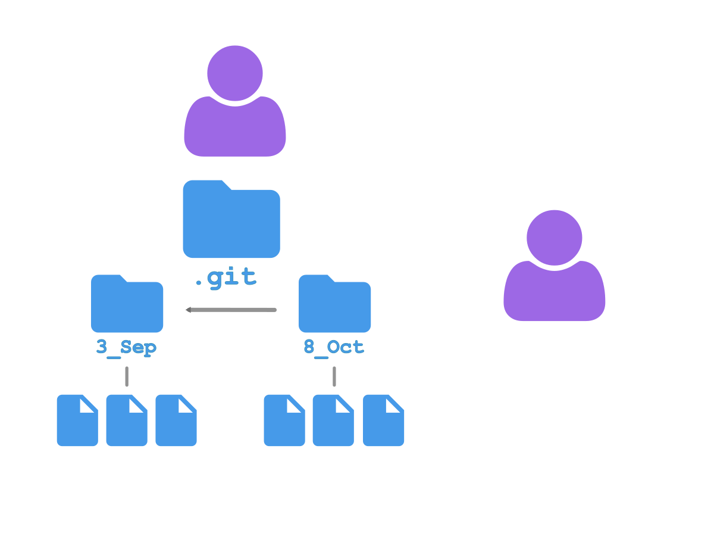
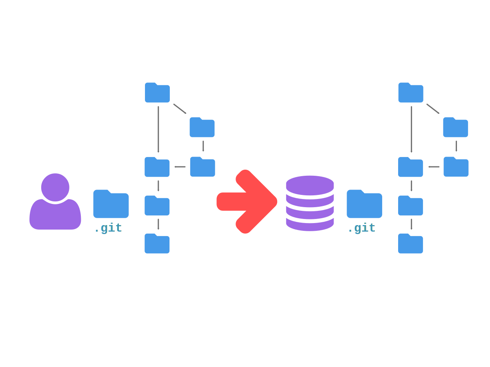

% Git For Analysts

What we're going to cover
-------------------------

1.  Playing by yourself.
2.  Playing with others.
 

Playing by yourself
-------------------

-------------------------


-------------------------


-------------------------


-------------------------


-------------------------


-------------------------


-------------------------


-------------------------


-------------------------


-------------------------


-------------------------


-------------------------


-------------------------


-------------------------


-------------------------


-------------------------


-------------------------


-------------------------


-------------------------


-------------------------


Playing with others
-------------------


-------------------------



-------------------------


-------------------------


-------------------------

```r
important_function = function() {
    do_something()
    do_something_else()
}
```

-------------------------

```r
important_function = function() {
    do_something()
    do_something_else_better()
}

do_something_else_better = function() {
    1/0
}
```

-------------------------


-------------------------


-------------------------


-------------------------


-------------------------


-------------------------


-------------------------



-------------------------


-------------------------


-------------------------


-------------------------


-------------------------


-------------------------


-------------------------


-------------------------


That's a lot of widgets just for tracking program versions!
-----------------------------------------------------------


-------------------------


If you are writing code that will be shared...
----------------------------------------------

1.  Commit immediately after finishing a change, and commit often.
    Don't let code go stale!

2.  Each branch, and especially each commit, should only deal with one feature.


-------------------------


-------------------------


